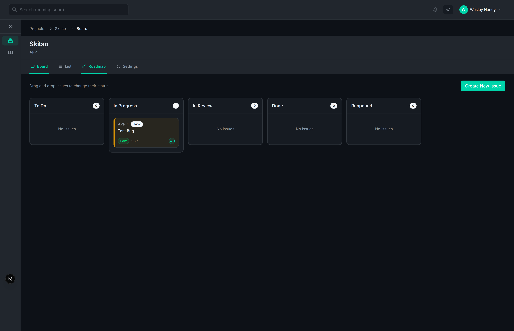

# Stride


> Developer-first, open-source flow tracker that matches the speed and developer experience of proprietary tools like Linear, with a narrow, opinionated focus on the Engineering-Product-Design (EPD) flow.

## Table of Contents

- [What is Stride?](#what-is-stride)
- [Key Features](#key-features)
- [Quick Start](#quick-start)
- [Configuration](#configuration)
- [Usage](#usage)
- [Development](#development)
- [Contributing](#contributing)
- [Architecture](#architecture)
- [Technology Stack](#technology-stack)
- [Support](#support)
- [License](#license)

## What is Stride?

Stride is a developer-first, open-source issue tracking and workflow management tool designed specifically for Engineering-Product-Design (EPD) teams. Built with modern web technologies and a focus on speed, Stride provides a keyboard-driven, opinionated workflow that matches the developer experience of proprietary tools while remaining fully self-hosted and open source.

Unlike enterprise-focused solutions that try to be everything to everyone, Stride takes a narrow, opinionated approach. It focuses exclusively on the EPD flow—the critical path from product requirements through engineering implementation to design validation. This focus allows Stride to be faster, simpler, and more intuitive than bloated alternatives.

Stride combines the best aspects of modern issue trackers: the speed of Linear, the configurability of Jira, and the simplicity of GitHub Issues. With features like configuration as code, AI-powered triage, monitoring webhook integration, and rich contextual information (Mermaid diagrams, link previews), Stride gives teams the tools they need without the complexity they don't.

### Why Stride?

- **Developer-First**: Built by developers, for developers. Every feature prioritizes developer productivity and workflow efficiency.
- **Self-Hosted**: Your data, your control. Deploy on your infrastructure with full control over sensitive information.
- **Fast & Modern**: Keyboard-driven command palette, instant navigation, and blazing-fast performance that matches proprietary tools.
- **Opinionated**: Focused on EPD flow, not enterprise bloat. No unnecessary features that slow down core workflows.
- **Open Source**: AGPL-3.0 licensed, community-driven development with full source code access and modification rights.

## Key Features

- 📋 **Issue Management with Kanban Board**: Visual board interface for tracking issues through customizable workflows with drag-and-drop status transitions
- ⚙️ **Configuration as Code**: Version-controlled workflow definitions via `stride.config.yaml` files stored in your repository
- 🔗 **Git Integration**: Automatic synchronization with GitHub and GitLab via webhooks for branch/PR status updates and issue linking
- 🎯 **Sprint/Cycle Management**: Create time-bounded work periods, assign issues to sprints, and track progress with burndown charts
- 🤖 **AI-Powered Triage**: Optional AI assistance for issue analysis, prioritization, and recommendations with support for multiple providers (Ollama, OpenAI, Anthropic, Google Gemini)
- 📊 **Monitoring Webhooks**: Automatic issue creation from error events via integrations with Sentry, Datadog, and New Relic
- 🔍 **Root Cause Diagnostics Dashboard**: View error traces, diagnostic information, and related issues in a unified dashboard
- ⌨️ **Keyboard-Driven Command Palette**: Fast navigation and actions via keyboard shortcuts and command palette (Cmd/Ctrl+K)
- 📈 **Mermaid Diagram Rendering**: Visualize workflows, architecture, and relationships with embedded Mermaid diagrams
- 🔗 **Contextual Link Previews**: Rich previews for external links to Notion, Google Drive, Confluence, and other services



## Quick Start

### Prerequisites

- Docker and Docker Compose
- Git

### Installation

1. **Clone the repository**

   ```bash
   git clone https://github.com/your-org/stride.git
   cd stride
   ```

2. **Configure environment variables**

   ```bash
   cp .env.example .env
   # Edit .env and set required variables:
   # - JWT_SECRET (min 32 characters)
   # - SESSION_SECRET (min 32 characters)
   # - DB_PASSWORD (optional, defaults to stride_dev_password)
   ```

3. **Start services**

   ```bash
   docker-compose up -d
   ```

4. **Create admin account**
   - Navigate to http://localhost:3000
   - Complete the admin account creation form
   - Link your first repository (optional)

5. **Verify installation**
   - Access the dashboard at http://localhost:3000
   - Create a test issue
   - Verify the Kanban board displays correctly

**That's it!** You're ready to use Stride. Optional integrations (AI providers, monitoring webhooks, and SMTP) are available and documented in the [Configuration](#configuration) section.

For production deployment options and advanced setup, see the [Deployment Documentation](docs/deployment/README.md).

## Usage

### Issue Creation and Management

Stride provides a visual Kanban board interface for managing issues through customizable workflows. Create issues via the command palette (`Cmd/Ctrl+K`), assign them to team members, and move them between status columns with drag-and-drop. Each issue supports rich descriptions, attachments, labels, and custom fields.

**Workflow**: Press `Cmd/Ctrl+K` → Type "create issue" → Fill in details → Assign and move through status columns on the board.

For detailed instructions, see the [User Documentation](docs/user/README.md).

### Sprint Planning and Cycle Management

Create time-bounded work periods (sprints or cycles) to organize work and track velocity. Assign issues to sprints, set start and end dates, and monitor progress with burndown charts. Stride automatically calculates sprint metrics and provides insights into team velocity.

**Workflow**: Create sprint → Assign issues → Track progress → Review burndown charts and velocity metrics.

For detailed instructions, see the [User Documentation](docs/user/README.md).

### AI Triage Workflow

Leverage AI-powered analysis to automatically triage issues, suggest priorities, and provide recommendations. Configure AI providers (Ollama, OpenAI, Anthropic, Google Gemini) at the project level, then trigger AI analysis for individual issues or in bulk.

**Workflow**: Configure AI provider → Trigger AI analysis → Review suggestions → Accept or modify recommendations → Apply to issues.

For detailed instructions, see [AI Triage Guide](docs/user/ai-triage.md).

### Monitoring Webhook Integration

Automatically create issues from error events in your monitoring tools. Connect Sentry, Datadog, or New Relic webhooks to your project, and Stride will create issues with full error context, stack traces, and diagnostic information.

**Workflow**: Configure webhook in monitoring tool → Set up webhook endpoint in Stride → Issues automatically created from error events → Link to root cause diagnostics.

For detailed instructions, see [Monitoring Webhooks Guide](docs/integrations/monitoring-webhooks.md).

### Configuration as Code Editing

Define workflows, statuses, and custom fields using `stride.config.yaml` files in your repository. Edit configuration files directly in Stride's built-in YAML editor with syntax highlighting, validation, and live preview.

**Workflow**: Open project settings → Navigate to Configuration → Edit `stride.config.yaml` → Validate and save → Changes sync to repository.

For detailed configuration as code documentation, see the [Configuration Guide](docs/configuration/README.md).

### Git Branch/PR Linking

Automatically link issues to Git branches and pull requests. When you create a branch or open a PR, Stride automatically updates issue status and provides bidirectional linking between code and issues.

**Workflow**: Create branch with issue reference → Open PR → Stride automatically links → Status updates reflect PR state → Merge updates issue status.

For detailed instructions, see [Git Integration Guide](docs/integrations/git-oauth.md).

### Root Cause Diagnostics

View comprehensive error traces, diagnostic information, and related issues in a unified dashboard. Link issues to error events from monitoring tools, view stack traces, and trace issues back to their root causes.

**Workflow**: View issue → Access diagnostics tab → Review error traces → Link to related issues → Trace root cause.

For detailed instructions, see the [User Documentation](docs/user/README.md).

### Keyboard Shortcuts and Command Palette

Navigate Stride entirely via keyboard using the command palette (`Cmd/Ctrl+K`) and keyboard shortcuts. Create issues, navigate boards, filter views, and perform actions without touching the mouse.

**Workflow**: Press `Cmd/Ctrl+K` → Type command → Execute action → Use arrow keys to navigate → Press Enter to select.

For detailed instructions, see the [User Documentation](docs/user/README.md).

## Configuration

Stride uses a two-level configuration system: **infrastructure-level** (system-wide, environment variables) and **project-level** (per-project, UI-based settings). This separation allows you to configure shared infrastructure once while customizing each project independently.

### Configuration Levels

- **Infrastructure-Level Configuration**: System-wide settings configured via environment variables. These apply to all projects and include authentication secrets, database connections, email servers, OAuth credentials, and monitoring services. Configure these once at deployment time.

- **Project-Level Configuration**: Per-project settings configured via the UI. These include AI provider credentials, repository connections, monitoring webhook endpoints, and workflow definitions. Each project can have different settings.

### Required Environment Variables

These variables must be set for Stride to run:

| Variable         | Description                                           | Example                                            |
| ---------------- | ----------------------------------------------------- | -------------------------------------------------- |
| `JWT_SECRET`     | Secret for JWT token signing (minimum 32 characters)  | `your-secure-random-secret-here-min-32-characters` |
| `SESSION_SECRET` | Secret for session encryption (minimum 32 characters) | `your-session-secret-here-min-32-characters`       |
| `DB_PASSWORD`    | PostgreSQL database password (used by Docker Compose) | `your-secure-database-password`                    |

**Note**: `DATABASE_URL` is automatically generated from `DB_PASSWORD` in Docker Compose, but can be overridden if using an external database.

### Optional Environment Variables

These variables can be set to enable additional features:

| Variable               | Description                                                 | Default                  | Level          |
| ---------------------- | ----------------------------------------------------------- | ------------------------ | -------------- |
| `NODE_ENV`             | Environment mode (`development`, `production`, `test`)      | `development`            | Infrastructure |
| `NEXT_PUBLIC_APP_URL`  | Public application URL (used for OAuth callbacks and links) | `http://localhost:3000`  | Infrastructure |
| `AI_GATEWAY_URL`       | AI Gateway service URL (for AI features)                    | `http://ai-gateway:3001` | Infrastructure |
| `SMTP_HOST`            | SMTP server hostname for email notifications                | -                        | Infrastructure |
| `SMTP_PORT`            | SMTP server port                                            | `587`                    | Infrastructure |
| `SMTP_USER`            | SMTP authentication username                                | -                        | Infrastructure |
| `SMTP_PASSWORD`        | SMTP authentication password                                | -                        | Infrastructure |
| `SMTP_SECURE`          | Use TLS/SSL for SMTP connection (`true`/`false`)            | `false`                  | Infrastructure |
| `SMTP_FROM`            | From address for outgoing emails                            | -                        | Infrastructure |
| `SENTRY_DSN`           | Sentry DSN for error tracking                               | -                        | Infrastructure |
| `GITHUB_CLIENT_ID`     | GitHub OAuth App Client ID                                  | -                        | Infrastructure |
| `GITHUB_CLIENT_SECRET` | GitHub OAuth App Client Secret                              | -                        | Infrastructure |
| `GITLAB_CLIENT_ID`     | GitLab OAuth App Client ID                                  | -                        | Infrastructure |
| `GITLAB_CLIENT_SECRET` | GitLab OAuth App Client Secret                              | -                        | Infrastructure |

See the [Environment Variables Guide](docs/ENVIRONMENT_VARIABLES.md) for a complete configuration reference with all available variables.

### Infrastructure-Level Integrations

These integrations are configured system-wide via environment variables and apply to all projects:

#### AI Gateway URL

Configure the AI Gateway service URL to enable AI-powered features across all projects:

```env
AI_GATEWAY_URL=http://ai-gateway:3001
```

For self-hosted AI services (Ollama), set the LLM endpoint:

```env
LLM_ENDPOINT=http://localhost:11434
```

#### SMTP Email Setup

Configure SMTP for email notifications (invitations, alerts). Stride works fully without SMTP, but email enables automatic invitation emails.

```env
SMTP_HOST=smtp.example.com
SMTP_PORT=587
SMTP_USER=your-email@example.com
SMTP_PASSWORD=your-smtp-password
SMTP_SECURE=false
SMTP_FROM=noreply@your-domain.com
```

For local testing, use MailHog (included in Docker Compose):

```env
SMTP_HOST=mailhog
SMTP_PORT=1025
SMTP_SECURE=false
```

For detailed SMTP configuration, see [SMTP Integration Guide](docs/integrations/smtp.md).

#### Sentry Error Tracking

Enable error tracking and monitoring across all projects:

```env
SENTRY_DSN=https://your-sentry-dsn@sentry.io/project-id
ERROR_TRACKING_ENABLED=true
```

For detailed Sentry setup, see [Sentry Integration Guide](docs/integrations/sentry.md).

#### Git OAuth Credentials

Configure GitHub or GitLab OAuth App credentials to enable repository integration. These credentials are used by all projects for OAuth flows, but each project stores its own user access tokens.

**GitHub OAuth Setup**:

1. Create a GitHub OAuth App at https://github.com/settings/developers
2. Set Authorization callback URL to: `https://your-domain.com/api/auth/github/callback`
3. Configure environment variables:

```env
GITHUB_CLIENT_ID=your-github-client-id
GITHUB_CLIENT_SECRET=your-github-client-secret
```

**GitLab OAuth Setup**:

1. Create a GitLab OAuth App in your GitLab instance
2. Set Redirect URI to: `https://your-domain.com/api/auth/gitlab/callback`
3. Configure environment variables:

```env
GITLAB_CLIENT_ID=your-gitlab-client-id
GITLAB_CLIENT_SECRET=your-gitlab-client-secret
```

For detailed Git OAuth setup, see [Git OAuth Integration Guide](docs/integrations/git-oauth.md).

### Project-Level Integrations

These integrations are configured per-project via the UI and can differ between projects:

#### AI Provider Configuration

Configure AI providers (Ollama, OpenAI, Anthropic, Google Gemini) for each project independently. Set provider credentials and endpoints in Project Settings → AI Providers.

**Supported Providers**:

- **Ollama**: Self-hosted, open-source LLM (configure endpoint)
- **OpenAI**: Commercial API (requires API key)
- **Anthropic**: Claude API (requires API key)
- **Google Gemini**: Google AI API (requires API key)

Each project can use different providers or multiple providers simultaneously.

For detailed AI provider setup, see [AI Providers Guide](docs/integrations/ai-providers.md).

#### Repository Connections

Connect GitHub or GitLab repositories to projects for automatic issue linking and status updates. Each project can connect to different repositories using the global OAuth credentials.

Configure in Project Settings → Repository. The OAuth flow uses the infrastructure-level OAuth credentials, but stores user access tokens per-project.

For detailed repository connection setup, see [Git OAuth Integration Guide](docs/integrations/git-oauth.md).

#### Monitoring Webhook Setup

Configure monitoring webhook endpoints (Sentry, Datadog, New Relic) per-project to automatically create issues from error events. Each project can have different webhook configurations.

**Supported Services**:

- **Sentry**: Error tracking and performance monitoring
- **Datadog**: Application monitoring and APM
- **New Relic**: Application performance monitoring

Configure webhook endpoints in Project Settings → Integrations → Monitoring Webhooks.

For detailed monitoring webhook setup, see [Monitoring Webhooks Guide](docs/integrations/monitoring-webhooks.md).

### Configuration as Code

Stride supports configuration as code through `stride.config.yaml` files stored in your repository. Define workflows, statuses, custom fields, and automation rules in YAML format, version-controlled alongside your code.

**Benefits**:

- Version-controlled workflow definitions
- Consistent configuration across environments
- Easy backup and restoration
- Team collaboration via pull requests

Edit `stride.config.yaml` files directly in Stride's built-in YAML editor with syntax highlighting, validation, and live preview. Changes sync automatically to your repository.

For detailed configuration as code documentation, see the [Configuration Guide](docs/configuration/README.md).

### Production Deployment

For production deployments, ensure all required environment variables are set with secure values. Use strong, randomly generated secrets for `JWT_SECRET` and `SESSION_SECRET` (minimum 32 characters each).

**Security Best Practices**:

- Generate secrets using: `openssl rand -hex 32`
- Never commit secrets to version control
- Use environment variable management in your deployment platform
- Enable HTTPS (`NEXT_PUBLIC_APP_URL` should use `https://`)
- Set `NODE_ENV=production` for production deployments

For detailed production deployment instructions, see the [Deployment Documentation](docs/deployment/README.md).

## Development

### Prerequisites

- **Node.js**: Version 24.0.0 or higher ([Install Node.js](https://nodejs.org/))
- **pnpm**: Version 10.26.0 or higher ([Install pnpm](https://pnpm.io/installation))
- **Docker & Docker Compose**: For database (recommended)
- **PostgreSQL**: Version 16+ (if not using Docker)
- **Git**: For version control

### Local Development Setup

1. **Install dependencies**:

   ```bash
   pnpm install
   ```

2. **Database setup** (choose one):

   **Option A: Docker (Recommended)**:

   ```bash
   docker compose up -d stride-postgres
   # OR use the helper script
   ./scripts/db-start.sh
   ```

   **Option B: Local PostgreSQL**:
   - Install PostgreSQL 16+ locally
   - Create database: `createdb stride`
   - Update `DATABASE_URL` in `.env`

3. **Run database migrations**:

   ```bash
   pnpm --filter @stride/database db:generate
   pnpm --filter @stride/database db:deploy
   ```

4. **Start development servers**:

   ```bash
   pnpm dev
   ```

5. **Access the application**:
   - Web app: http://localhost:3000
   - Marketing site: http://localhost:3001 (optional)

### Monorepo Structure

Stride is a Turborepo monorepo with the following structure:

```
stride/
├── apps/
│   ├── web/              # Main Next.js application
│   └── site/             # Marketing website (MDX)
│
├── packages/
│   ├── ui/               # Shared UI component library
│   ├── database/         # Prisma schema and client
│   ├── types/            # Shared TypeScript types
│   ├── yaml-config/       # YAML configuration parser/validator
│   ├── ai-gateway/       # AI integration service
│   └── tsconfig/         # Shared TypeScript configs
│
├── docs/                 # Documentation
├── scripts/              # Utility scripts
└── specs/                # Feature specifications
```

**Key Directories**:

- **`apps/web`**: Main application using Next.js 16+ with App Router
- **`packages/ui`**: Shared component library following atomic design
- **`packages/database`**: Prisma schema and repository pattern implementation
- **`packages/types`**: Shared TypeScript types for type safety across packages

### Available Scripts

From the project root:

```bash
# Development
pnpm dev              # Start all development servers
pnpm dev --filter @stride/web  # Start only web app

# Building
pnpm build            # Build all packages and apps
pnpm build --filter @stride/web  # Build specific package

# Code Quality
pnpm lint             # Lint all packages
pnpm lint:fix          # Auto-fix linting issues
pnpm type-check        # Type check all packages
pnpm format            # Format code with Prettier
pnpm format:check      # Check code formatting

# Testing
pnpm test              # Run all tests
pnpm test --filter @stride/web  # Run tests for specific package
```

For detailed development instructions, see the [Development Guide](docs/development/README.md).

## Contributing

We welcome contributions! Please see our [Contributing Guidelines](CONTRIBUTING.md) for details.

### Quick Contribution Guide

1. **Fork the repository**
2. **Create a feature branch**

   ```bash
   git checkout -b feature/your-feature-name
   ```

3. **Make your changes**
   - Follow our [code standards](.specify/memory/constitution.md)
   - Write tests for new features
   - Update documentation as needed
4. **Submit a pull request**
   - Include description of changes
   - Reference any related issues
   - Ensure all tests pass

### Development Standards

- TypeScript strict mode
- Follow SOLID principles
- Write tests for critical paths
- Document non-obvious decisions
- Ensure accessibility (WCAG 2.1 AA)

See [Contributing Guidelines](CONTRIBUTING.md) for complete contribution process.

## Architecture

Stride is built as a modern monorepo using Turborepo for build orchestration. The application follows a layered architecture with clear separation between frontend, backend, and data layers.

### High-Level Architecture

- **Frontend**: Next.js Server Components + Client Components for optimal performance and SEO
- **Backend**: Next.js API Routes + Server Actions for type-safe server-side logic
- **Database**: PostgreSQL with Prisma ORM for type-safe database access
- **AI Gateway**: Separate service for LLM integration (self-hosted or commercial)
- **External Integrations**: Webhooks for Git services and monitoring tools

The architecture emphasizes:

- **Server Components First**: Default to server-side rendering for better performance
- **Type Safety**: End-to-end type safety from database to UI
- **Repository Pattern**: Abstracted data access layer for testability and flexibility
- **Service Layer**: Business logic separated from routes for reusability

For detailed architecture information, see the [Architecture Documentation](docs/architecture.md).

## Technology Stack

### Core Technologies

- **Framework**: Next.js 16+ (App Router, React Server Components)
- **Language**: TypeScript (strict mode)
- **Database**: PostgreSQL 16+ with Prisma ORM
- **Styling**: Tailwind CSS with custom design tokens
- **State Management**: Jotai (global client state), TanStack Query (server state)
- **Monorepo**: Turborepo with pnpm

### Key Libraries

- **`@uiw/react-codemirror`**: YAML configuration editor with syntax highlighting
- **`dnd-kit`**: Drag-and-drop for Kanban boards and sprint planning
- **`react-markdown` + `remark-gfm`**: Markdown rendering with GitHub Flavored Markdown
- **`mermaid`**: Diagram rendering (flowcharts, sequence diagrams)
- **`js-yaml`**: YAML parsing and validation
- **`zod`**: Runtime type validation for API requests and configuration

### Architecture Patterns

- **Repository Pattern**: Abstract data access layer (Prisma-based)
- **Service Layer**: Business logic separation from routes
- **Configuration as Code**: `stride.config.yaml` version-controlled workflow definitions
- **Webhook Processing**: Asynchronous processing with signature verification
- **JSONB Custom Fields**: Dynamic field storage in PostgreSQL JSONB columns

For detailed technology stack documentation, see the [Development Guide](docs/development/README.md).

## Support

Need help? We're here for you!

### Getting Help

- **GitHub Issues**: Report bugs and request features on [GitHub Issues](https://github.com/your-org/stride/issues)
- **GitHub Discussions**: Ask questions and share ideas on [GitHub Discussions](https://github.com/your-org/stride/discussions)
- **Documentation**: Browse our comprehensive [documentation](docs/README.md) for guides and references

### Security Issues

For security vulnerabilities, please email **security@your-domain.com** instead of opening a public issue. We'll respond promptly and coordinate responsible disclosure.

### Community

Join our community to stay updated, share feedback, and connect with other Stride users:

- Follow development updates on GitHub
- Participate in discussions
- Contribute to the project

## License

Stride is licensed under the **GNU Affero General Public License v3.0 (AGPL-3.0)**.

This license ensures that:

- You can use, modify, and distribute Stride
- Any modifications you make must be shared under the same license
- If you run a modified version on a server, you must provide the source code to users

See the [LICENSE](LICENSE) file for the full license text.

For more information about the AGPL-3.0 license, visit [https://www.gnu.org/licenses/agpl-3.0.html](https://www.gnu.org/licenses/agpl-3.0.html).

---

Made with ❤️ by the Stride community
